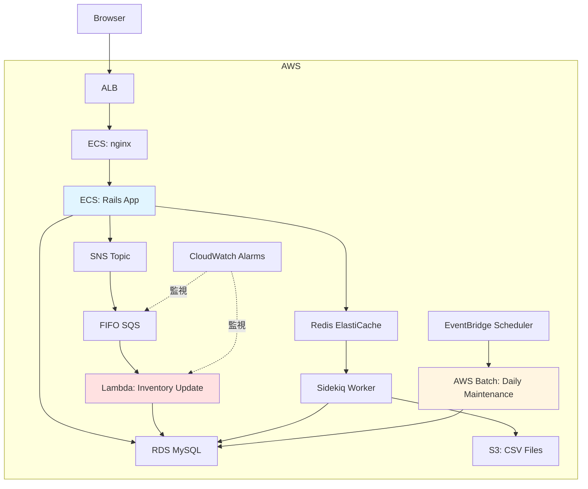
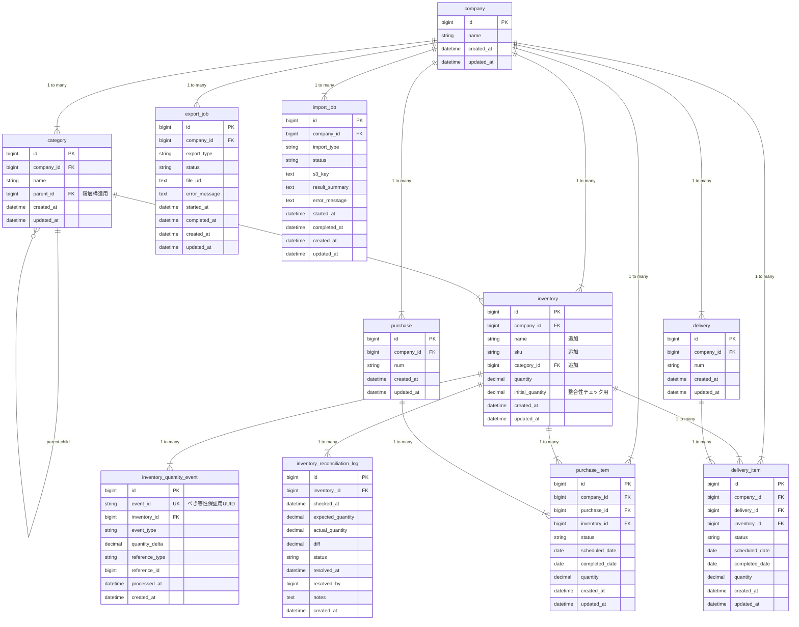

# アーキテクチャ案及び実装方針案

## 全体構成図

### インフラ構成（改善後）



**主要コンポーネント**:
- **Rails App**: API/UI、after_commit で SNS 発行
- **Lambda**: 在庫数量更新（FIFO SQS 経由、順序保証）
- **Sidekiq**: インポート/エクスポート（非同期ジョブ）
- **AWS Batch**: 日次メンテナンス（整合性チェック、クリーンアップ）
- **Redis**: Sidekiq キュー、短時間キャッシュ（オプション）
- **CloudWatch**: DLQ監視、処理成功率、エラー数

---

## ER図（改善後）



**追加テーブル**:
- `category`: カテゴリマスタ（検索機能用）
- `inventory_quantity_event`: Lambda 処理履歴（べき等性 + 整合性チェック用）
- `inventory_reconciliation_log`: 整合性チェック結果（履歴追跡 + アラート用）
- `export_job` / `import_job`: 非同期ジョブ管理（Sidekiq 用）

**inventories テーブルに追加**:
- `name`, `sku`, `category_id`: 検索機能用
- `initial_quantity`: 整合性チェック用（初期在庫数）

---

# アーキテクチャ案及び実装方針案
## 項目1 予定フリー在庫の計算方式
特定日時点の予定フリー在庫数の計算方式の実装方針について

- **リアルタイム計算 + クエリ最適化**を採用する。
	- キャッシュ機構やパーティションテーブルは1在庫につき、入出庫データが最大1000件という条件においては過剰と判断。
- 複合インデックス`(inventory_id, scheduled_date, status)`を使用したリアルタイム計算で十分な性能だと考える。
- 過去日を考慮しなくてよいという要件により、`scheduled_date >= CURRENT_DATE`でクエリを絞り込み、スキャン対象をさらに削減する。
- N+1問題をバッチクエリで解消し、scheduled_date更新時も次回リクエスト時に自動反映されるため、キャッシュ再計算が不要となる。
- 100万件という絶対数は大きいが、実際のクエリは在庫ID + 未来日付で絞り込まれるため、性能影響は限定的である。
	- 合わせて一覧時の計算もページネーションにより最大数を調整可能なため、最大で50在庫ほどの計算と想定している
### クエリ案
- 一覧用
```ruby
  def list_with_logical_quantities(date:, page:, limit:)
    inventories = company.inventories.page(page).per(limit)
    inventory_ids = inventories.map(&:id)

    # 一括で取得(50在庫分の出庫/入庫明細を取得)
    purchase_sums = PurchaseItem.not_completed
      .where(inventory_id: inventory_ids)
      .where('scheduled_date >= ?', Date.current)  # 過去日除外
      .where('scheduled_date <= ?', date)
      .group(:inventory_id).sum(:quantity)

    delivery_sums = DeliveryItem.not_completed
      .where(inventory_id: inventory_ids)
      .where('scheduled_date >= ?', Date.current)  # 過去日除外
      .where('scheduled_date <= ?', date)
      .group(:inventory_id).sum(:quantity)

    # メモリ上で計算
    logical_quantities = inventories.map do |inv|
      {
        id: inv.id,
        quantity: inv.quantity,
        logical_quantity: inv.quantity +
          (purchase_sums[inv.id] || 0) -
          (delivery_sums[inv.id] || 0)
      }
    end
  end
```

※ もし参照アクセスが多く、計算コストがかかりすぎる場合Redisで短時間（1~2分で自動失効）キャッシュを行い、3分の反映要件を満たすようにする。
取得できなかった場合は、再計算してRedisに投入するフォールバックも行う
```ruby
# Redis等で短時間キャッシュ（TTL: 1分）
def logical_quantity_at(inventory_id, date)
  cache_key = "logical_qty:#{inventory_id}:#{date}"

  Rails.cache.fetch(cache_key, expires_in: 1.minute) do
    calculate_logical_quantity(inventory_id, date)
  end
end
```

### 複合インデックスについて
一覧での複数在庫データに対する予定フリー在庫の計算と詳細画面での1在庫データに対する複数の予定フリー在庫の計算の両方を満たすインデックスを考慮する
- purchase_items / delivery_items に複合インデックスを追加する。
```sql
INDEX idx_on_inventory_id_scheduled_date_status
  (inventory_id, scheduled_date, status)
```
- カラム順序は「等価条件 → 範囲条件 → フィルタ条件」の原則に従い、インデックススキャンが効率的に動作する。
	- クエリ改善に依って想定されるクエリ例
```sql
SELECT SUM(quantity)
FROM purchase_items
WHERE inventory_id = ? -- 等価条件
  AND scheduled_date <= ? -- 範囲条件
  AND status != 'completed'; -- フィルタ条件
```
- status単独のインデックスはカーディナリティが低く不要、パーティショニングも現データ量では過剰と判断する。

- もし、性能要件が満たせない場合は、quantity も同様にindex に含んでしまう CoveringIndexを貼ってテーブルアクセスをしないようにする
```sql
INDEX idx_inventory_scheduled_status_quantity
  (inventory_id, scheduled_date, status, quantity)
```

## 項目2 在庫一覧APIのページネーション
**kaminari gem を導入してページネーションを実装する**。
- 在庫一覧は最大20万レコードに達するため、ページネーション（1ページ50件）を行う
- kaminariを使用することでOFFSET/LIMIT句を使用してDB側で絞り込みを行う。
- 項目1と組み合わせ、50件のinventory_idに対してバッチクエリで入出庫集計を実行する。
- ページ番号とlimitはAPIレスポンスに含め、フロントエンドでページング操作を可能にする。
- インデックス `(company_id, id)` により、company_id絞り込み後のOFFSETが高速に動作する。
### ⤴️ 拡張予測
20万在庫データに対して検索・カテゴリ機能が導入されることが予測されるため、その時の3段階の実装方針を検討する

- 基本案
	- categoriesテーブルを新規追加し、inventoriesに`name`, `sku`, `category_id`を追加。
	- カテゴリ絞り込み用に`(company_id, category_id, id)`、前方一致検索用に`(company_id, name)`の複合インデックスを追加。
	- 検索結果50件に対して予定フリー在庫をバッチ計算する or この要件が出た場合にはキャッシュを検討する

- 改善検討1（N-gramインデックス）
	- 部分一致検索が必要な場合、`FULLTEXT INDEX WITH PARSER ngram`を追加。
	- `LIKE '%keyword%'` による全件スキャンを回避し、部分一致検索を実現。実装コスト低、インデックスサイズは約3-5倍増加。

- 改善検討2（Elasticsearch）
	- あいまい検索（タイポ許容）、類義語検索、複数カラム全文検索が必要な場合に導入。
	- 日本語対応（kuromoji）。インフラコスト高、データ同期が必要。100万件超または改善検討1で不十分な場合に検討する

## 項目3 在庫数量の更新管理

在庫更新の10rpmに対して、整合性を保ちつつ更新ができる方法を検討する

- Lambda + FIFO SQS + イベントログ方式とする
- 入出庫完了（status='completed'）時、SNS経由でFIFO SQSにイベントをエンキューし、Lambdaで非同期処理する。
	- ただし、FIFO SQSのMessage Group ID（`inventory-{inventory_id}`）により同一在庫への更新順序を保証する。
- event_id（UUID）をユニーク制約として、べき等性を保証し、Lambda失敗時のリトライでも重複適用を防止する。
- また日次などでバッチを用いて入出庫明細と在庫情報の整合性チェックヲ行う

### ▶️ 処理順序の保証
- FIFO での処理と message_group により同一在庫の処理は必ずキューが入った順に逐次されるように担保する
```ruby
# after commit する処理
purchase_item.update!(status: 'completed')

class PurchaseItem < ApplicationRecord
  after_commit :publish_quantity_update_event, on: :update, if: :completed? # after_commit 契機でSNSイベント結果を貯める

  def publish_quantity_update_event
    sns_client = Aws::SNS::Client.new

    sns_client.publish(
      topic_arn: ENV['INVENTORY_QUANTITY_TOPIC_ARN'],
      message: {
        event_id: SecureRandom.uuid,
        ...
        timestamp: Time.current.iso8601
      }.to_json,
      message_group_id: "inventory-#{inventory_id}",  # 同一在庫で順序保証
      message_deduplication_id: "#{self.class.name}-#{id}-#{updated_at.to_i}"
    )
  end
end
```
### ✅ べき等性保証
- Lambda のリトライが走っても同じイベントを重複して処理しないようにする
	- eventテーブルを用意し、event_id を UNIQUE制約をかけてトランザクションを貼ることで、同イベントの重複処理から保護する

```ruby
	  ActiveRecord::Base.transaction do
    # 1. イベントログを記録（event_id が UNIQUE制約）
    begin
      InventoryQuantityEvent.create!(
        event_id: event_id,  # UNIQUE制約により重複を防止
        inventory_id: inventory_id,
        event_type: 'quantity_update',
        quantity_delta: quantity_delta,
        reference_type: message['reference_type'],
        reference_id: message['reference_id'],
        processed_at: Time.current
      )
    rescue ActiveRecord::RecordNotUnique
      # 既に処理済み（Lambda がリトライした場合）
      Rails.logger.info("[Idempotent] event_id=#{event_id} already processed")
      return { statusCode: 200, body: 'Already processed' }
    end

    # 2. 在庫数量を更新
    inventory = Inventory.lock.find(inventory_id)
    inventory.quantity += quantity_delta

    # 3. マイナス在庫チェック
    if inventory.quantity < 0
      raise "Negative quantity: inventory_id=#{inventory_id}, quantity=#{inventory.quantity}"
    end

    inventory.save!
  end
```

**重要**: イベント記録と在庫更新は**同じトランザクション内**で実行。両方成功 or 両方ロールバック。

## 項目4 ジョブキュー導入
import や export 処理による更新がある場合は非同期のジョブキューによる処理の検討が必要
- 日次メンテナンスバッチ（AWS Batch）
- オンデマンドジョブ（Sidekiq）
	- Sidekiq導入の場合はストレージとしてRedisを用意し、生成ファイルはS3に格納する

## 検討5 過去データのクリーンアップ
completed status の過去データはテーブル肥大化の要因となるデータのため、日次の整合性チェックに合格した場合もしくは一定期間より前の入出庫明細データは、クリーンアップする（入出庫明細を残す必要がない場合）
- 1. 古いデータ削除（1年前のcompleted、1000件ずつバッチ削除）
- 2. テーブル最適化（OPTIMIZE TABLE）
- 3. 統計情報更新（ANALYZE TABLE）

# オプション検討
現状では過剰設計だが、将来のスケール具合において対応を検討すべき項目についてまとめる。
## オプション検討1 各顧客データ数の増加及び大口顧客対応
全顧客のデータ数が想定より増えた場合または想定より多いデータ数を格納する顧客が出てきた場合の対応案(マルチテナントスケール)について
- `company_id` をベースに `purchase_items / delivery_items / inventories` をパーティションで分ける
	- ただし多くても100程度とし、これによるパフォーマンス劣化が発生しないかについては計測・監視を行う
	- 場合によっては A/B 検証も検討する
```sql
-- purchase_items / delivery_items / inventories に適用
ALTER TABLE purchase_items
PARTITION BY HASH(company_id)
PARTITIONS 100;
```
**メリット**
- 会社ごとにデータが物理的に分離
- 大口顧客の負荷が他社に影響しにくい
- パーティション単位のバックアップ・リストアが可能

**デメリット**
- パーティション管理の複雑化
- company_id絞り込みがないクエリでは効果なし
- マイグレーション時のダウンタイム
## オプション検討2 整合性チェック結果テーブル
整合性のチェック結果を保存し、インサイト分析に役立てる
特に利用数が増えて物理的な整合性チェック検証ができなくなってきた場合に導入を検討する

**メリット**:
- 不整合の履歴追跡（いつから不整合が発生したか）
- 傾向分析（どの在庫で頻繁に不整合が起きるか）
- アラート基準の設定（3日連続不整合 → 通知）
- 整合性チェックの結果をダッシュボードで可視化

**デメリット**:
- ストレージコスト（20万在庫 × 毎日 = 7300万レコード/年）
- 古いログの削除が必要

## オプション検討3 深いOFFSETによる性能劣化対策

下記のようなデータ量が多いケースにおいて深いOFFSETは性能劣化が予測される。
```sql
SELECT * FROM inventories
WHERE company_id = ?
LIMIT 50 OFFSET 250000; -- 25万件スキップ（遅い）
```

データを絞り込んだ上でのORDER BY による並び変えをおこなう

```sql
SELECT * FROM inventories
WHERE company_id = ?
  AND id > ? -- 閲覧ページの最後のid
ORDER BY id
LIMIT 50; -- スキップ不要（高速）
```

**メリット**:
- ランダムページアクセスが高速
- OFFSET不要

**デメリット**:
- インデックス更新コスト（データ追加時に再構築）
- 複雑性の増加

## オプション検討4 グラフ表示用テーブル
予定フリー在庫の表示期間が1年や半年など長期間の表示が必要なケースにおいては都度計算だと計算量が膨大になるため、キャッシュテーブルを用意する

```sql
CREATE TABLE inventory_logical_quantity_daily (
    inventory_id BIGINT NOT NULL,
    target_date DATE NOT NULL,
    logical_quantity DECIMAL(18, 4) NOT NULL,
    calculated_at DATETIME NOT NULL,
    PRIMARY KEY (inventory_id, target_date),
    INDEX idx_date (target_date)
);
```

**メリット**:
- 365日分のグラフ: 計算不要で即座に表示
- DB負荷削減

**デメリット**:
- scheduled_date 更新時に再計算が必要（キャッシュ方式の課題再発）
- ストレージコスト
- 実装複雑化